# 🛩️ Autonomous FOD Detection System using VTOL Drone

This project is a real-time Foreign Object Debris (FOD) detection system that uses YOLO ML Model on the server and a VTOL drone for automatic scanning and geo-tagging of debris on runways or racing circuits. Built for accuracy, safety, and automation.

---

## 🔍 System Overview

A VTOL drone conducts aerial scans and streams live video to the server. The server uses a trained AI model to detect debris in real-time. If any FOD is found, it marks its location, retrieves precise GPS coordinates from a telemetry module, logs them, and alerts the ground team.

Our YOLO model is trained on a hybrid dataset of 50,000+ images, combining public FOD datasets with custom-labeled drone footage across varied conditions. Integrated with ByteTrack, it assigns persistent IDs to detected debris, enabling stable, duplicate-free tracking even during motion or occlusion.

An automatic pick-and-place rover for FOD removal is currently a work in progress.

---

```mermaid
flowchart TD
    A[🛩️ VTOL Drone Launch] --> B[⚙️ Configure Flight Path]
    B --> C[🚀 Start Autonomous Flight]
    C --> D[📹 GoPro Camera + Live Stream]
    D --> E[🤖 YOLO AI Processing]
    E --> F{🔍 FOD Detected?}
    F -->|✅ Yes| G[📍 Mark FOD + Get GPS]
    G --> H[💾 Log to Database]
    H --> I[🚨 Alert Ground Team]
    I --> J{🏁 Flight Complete?}
    F -->|❌ No| J
    J -->|🔄 No| K[🗺️ Next Waypoint]
    K --> E
    J -->|✅ Yes| L[🏠 Return Home & Land]
    L --> M[🎯 Mission Complete]
    
    %% Manual Override
    N[📡 Remote Control] -.->|⚡ Manual Override| O[🕹️ Manual Flight]
    O --> P{🔄 Resume Auto?}
    P -->|✅ Yes| C
    P -->|❌ No| Q[🛬 Manual Landing]
    
    %% Future Enhancement
    R[🚧 Future: Rover Integration] -.->|🔧 WIP| S[🤖 Auto FOD Removal]
    H -.->|📍 Coordinates| R
    
    %% Beautiful Styling with Rich Colors and Effects
    classDef drone fill:#e1f5fe,stroke:#0277bd,stroke-width:4px,color:#01579b,font-weight:bold,font-size:14px
    
    classDef detection fill:#f3e5f5,stroke:#7b1fa2,stroke-width:4px,color:#4a148c,font-weight:bold,font-size:14px
    
    classDef alert fill:#ffebee,stroke:#c62828,stroke-width:4px,color:#b71c1c,font-weight:bold,font-size:14px
    
    classDef manual fill:#fff3e0,stroke:#ef6c00,stroke-width:4px,color:#bf360c,font-weight:bold,font-size:14px
    
    classDef future fill:#e8f5e8,stroke:#2e7d32,stroke-width:4px,stroke-dasharray:10 10,color:#1b5e20,font-weight:bold,font-size:14px
    
    classDef decision fill:#fff9c4,stroke:#f57f17,stroke-width:5px,color:#e65100,font-weight:bold,font-size:16px
    
    classDef complete fill:#4caf50,stroke:#1b5e20,stroke-width:5px,color:#ffffff,font-weight:bold,font-size:16px
    
    %% Apply classes
    class A,B,C,D,K,L drone
    class E,G detection
    class H,I alert
    class N,O,P,Q manual
    class R,S future
    class F,J decision
    class M complete
    
    %% Enhanced link styling with rich colors
    linkStyle 0 stroke:#0277bd,stroke-width:4px
    linkStyle 1 stroke:#0277bd,stroke-width:4px
    linkStyle 2 stroke:#0277bd,stroke-width:4px
    linkStyle 3 stroke:#7b1fa2,stroke-width:4px
    linkStyle 4 stroke:#7b1fa2,stroke-width:4px
    linkStyle 5 stroke:#c62828,stroke-width:4px
    linkStyle 6 stroke:#c62828,stroke-width:4px
    linkStyle 7 stroke:#c62828,stroke-width:4px
    linkStyle 8 stroke:#c62828,stroke-width:4px
    linkStyle 9 stroke:#f57f17,stroke-width:4px
    linkStyle 10 stroke:#0277bd,stroke-width:4px
    linkStyle 11 stroke:#0277bd,stroke-width:4px
    linkStyle 12 stroke:#2e7d32,stroke-width:4px
    linkStyle 13 stroke:#2e7d32,stroke-width:4px
    linkStyle 14 stroke:#ef6c00,stroke-width:4px,stroke-dasharray:8 8
    linkStyle 15 stroke:#ef6c00,stroke-width:4px
    linkStyle 16 stroke:#ef6c00,stroke-width:4px
    linkStyle 17 stroke:#ef6c00,stroke-width:4px
    linkStyle 18 stroke:#2e7d32,stroke-width:4px,stroke-dasharray:8 8
    linkStyle 19 stroke:#2e7d32,stroke-width:4px,stroke-dasharray:8 8
```

> ⚠️ Mermaid diagrams render only on the GitHub **website**. They may not display correctly in the GitHub **mobile app**.
---

## ⚙️ Components

### Hardware
- **VTOL Drone** – Capable of autonomous flight and manual override  
- **GoPro Camera** – Mounted on the drone for video capture  
- **VTX / HDMI TX-RX** – Transfers live video feed to the server  
- **Telemetry Module** – Provides real-time GPS data to the server  
- **RX Remote** – Manual control in conflict scenarios  

### Software
- **YOLO/AI Model** – Detects FOD in video frames  
- **Server** – Processes video, logs coordinates, and alerts ground team  
- **Database** – Stores FOD detection data for audit and review  
- **Alerting System** – Sends notification and co-ordinates upon detection  

---

## 🔁 Workflow

1. VTOL drone is launched and performs a configured autonomous flight
2. It streams live video to the server via VTX/HDMI TX-RX for low latency
3. The server analyzes each frame using a YOLO model trained for FOD detection
4. If FOD is detected:
   - Marked in video
   - Coordinates retrieved from telemetry module
   - Location logged into database
   - Ground team is alerted instantly
5. If no FOD is detected, drone continues or returns home safely

---

## 🧷 Folder Structure

| Path             | Description                         |
|------------------|-------------------------------------|
| `app.py`         | Core application logic              |
| `templates/`     | Frontend assets (HTML files)        |
| `README.md`      | Project documentation               |
| `Mermaid.js Mind Map` *(Embedded)*    | Visual Overview of the System Architecture        |

---

## 🔧 Work in Progress

We are currently developing an **autonomous pick-and-place rover** that will work alongside the detection system to **remove detected FODs** from the runway or track in real time.

This rover will:
- Be deployed upon detection confirmation
- Navigate to the marked GPS coordinates
- Pick up FODs using a robotic mechanism
- Work autonomously or via manual override when needed

---

## 👥 Team

- **Ankit Prajapati** (Team Lead)
- **Yuvraj Tiwari** 
- **Moksh Dandotiya**  
- **Ankit Gurjar** 

---

## 📜 License

This project is **not open-source**. All rights are **strictly reserved** by the original authors.  
Any reproduction, redistribution, or unauthorized use of the code, models, or ideas is **strictly prohibited** without prior written permission.

See `LICENSE.md` for full legal terms.

---

## 👨‍💻 Author
- Written and maintained by Moksh Dandotiya.
- Contact: moksh@duck.com

---

